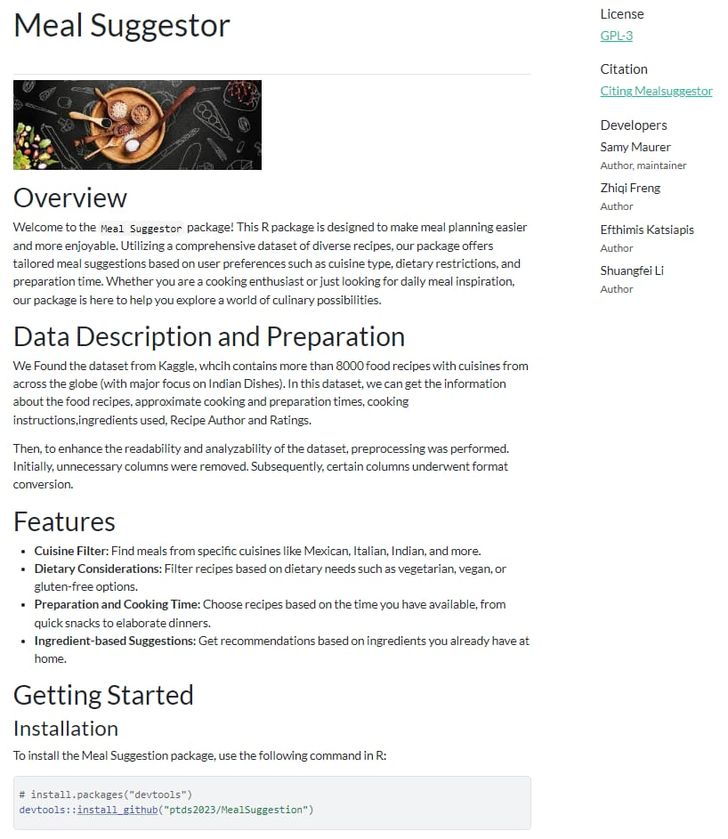
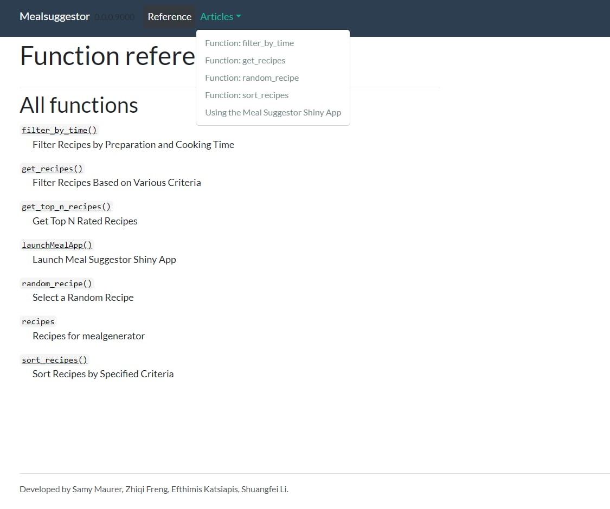
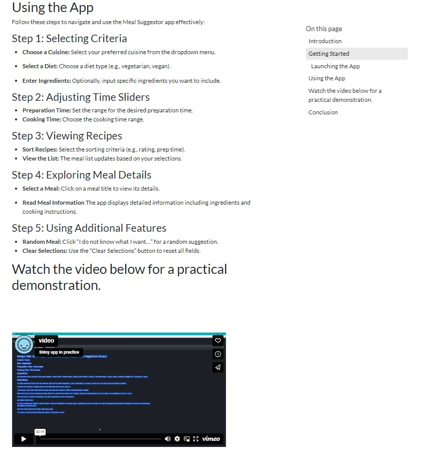

<style>
.remark-slide-content {
  font-size: 29px;
}
</style>


<style>
.custom-font-size {
  font-size: 20px;
}
</style>

---

background-image: url("images/food.jpeg")
background-position: center
background-size: contain

# Meal Suggestion Project

```{r setup, include=FALSE}
options(htmltools.dir.version = FALSE)
knitr::opts_chunk$set(
  fig.width=3, fig.height=100, fig.retina=3,
  out.width = "100%",
  cache = FALSE,
  message = FALSE, 
  warning = FALSE,
  echo = TRUE,
  hiline = TRUE
)
```

```{r include=FALSE, warning=FALSE}
library(xaringanthemer)
style_duo_accent(
  primary_color = "#4E5D6C",  # A dark slate gray for a sober feel
  inverse_header_color = "#F5F5F5",  # Light gray for the headers
  title_slide_text_color = "#F5F5F5"  # Light gray for text in the title slide
)
```

---

# A Meal Suggestor: A Gateway to Culinary Cretivity

You are alone and you feel that cooking the same pasta everyday get boring ? 

You want to train your cooking skills and discover new recipes everyday ? 

You want to impress your partner ? 

We have something for you !

---

class: custom-font-size

# Why a Mealsuggestor? 

*Addressing the Everyday Dilemma:*

- **The Challenge:** Everyone faces the "What to eat?" question. It's a daily decision that often leaves many indecisive or in a culinary rut.
- **The Need:** A solution to help simplify meal decisions, cater to various dietary preferences, and introduce culinary diversity.

*Empowering Personalized Meal Discovery:*

- **Innovation:** Combining data-driven insights with user preferences to suggest meals that align with individual tastes, dietary needs, and cooking skills.
- **Variety:** Offering a wide range of meal options from different cuisines, ensuring there's always something new to try.

*The Bigger Picture:*

- **Educational Aspect:** Encouraging users to explore new ingredients and cooking techniques.
- **Health and Wellness:** Facilitating healthier eating choices by providing balanced meal suggestions.


---

# Our Dataset

- **Initial tought:** Scrape from a recipe website OR find a large dataset with values that interested us

- **Source:** Kaggle

- **Structure:** 7990 rows and 16 columns

- **Variable:** food recipes, cooking and preparation times, cooking instructions,ingredients, recipe Author and Ratings

- **Objective:** Transform raw data into structured, usable format fot the shiny app


<div style="text-align: center">
---

# Data Wrangling

- **Cleaning Process:** Omitted missing values, ensuring data completeness.
- **Language Filtering:** Employed language detection to retain only English descriptions.
- **Time Conversion:** Transformed preparation and cooking time into usable numeric format.
- **Selective Retention:** Removed non-essential columns to focus on key attributes :
  - Recipe Title, Rating, Description, Cuisine, Course, Diet, Prep Time, Cook Time, Ingredients, Instructions
- **Secure the Data :** save the final dataset as a .rda file. 


<style>
.middle {
  margin-top: 150px; 
}
</style>

---


# Package Functions

We have a total of 5 functions for our package : 

- <b>filter_by_time</b>
- <b>get_recipes</b>
- <b>get_top_n_recipes</b>
- <b>random_recipe</b>
- <b>sort_recipes</b>

---

# get_recipes
This function filters the recipes dataset based on provided criteria such as ingredients,cuisine, diet. 


---
# filter_by_time
This function filters recipes based on specified minimum and maximum preparation and cooking times.

---

# get_top_n_recipes
This function retrieves the top N rated recipes from the dataset based on user ratings.

---

# random_recipe
This function selects a random recipe from the datase to suprise the customer
---

# LaunchMealApp
This function starts the Meal Suggestor Shiny application contained within the package
---


# Our ShinyApp


```{r, echo=FALSE, out.width='50%', fig.cap="shinyApp 1", out.extra='style="margin: auto; display: block;"'}
knitr::include_graphics("images/shinyApp 1.jpeg")
```
---

# Our ShinyApp


```{r, echo=FALSE, out.width='50%', fig.cap="shinyApp 2", out.extra='style="margin: auto; display: block;"'}
knitr::include_graphics("images/shinyApp 2.jpeg")
```
---

# Our ShinyApp

```{r, echo=FALSE, out.width='50%', fig.cap="shinyApp 3", out.extra='style="margin: auto; display: block;"'}
knitr::include_graphics("images/shinyApp 3.jpeg")
```

# Our Website

```{r, echo=FALSE, out.width='50%', fig.cap="Website 1", out.extra='style="margin: auto; display: block;"'}

```

---

# Our Website

```{r, echo=FALSE, out.width='50%', fig.cap="Website 2", out.extra='style="margin: auto; display: block;"'}

```

---

# Our Website

```{r, echo=FALSE, out.width='50%', fig.cap="Website 3", out.extra='style="margin: auto; display: block;"'}

```

---

# Limitation & Future Enhancement

Limitations:


- **Data Scope:** Currently, the Meal Suggestor relies on a static dataset, limiting its adaptability to evolving culinary trends.
- **Personalization:** The app lacks user-specific customization like saving preferences or suggesting based on past selections.

Future Enhancements:

- **Dynamic Data Integration:** Incorporating real-time data for more varied and updated meal suggestions.
- **User Profiles:** Adding the ability to create user profiles for personalized suggestions and saved preferences.
- **Add multiple:** Allow the user to add multiple ingrediants
- **Feedback System:** Implementing a user feedback system to refine and adapt meal suggestions.

---

class: center, middle

<html>
  <div class="custom-font">Thank you!</div>
</html>

---
