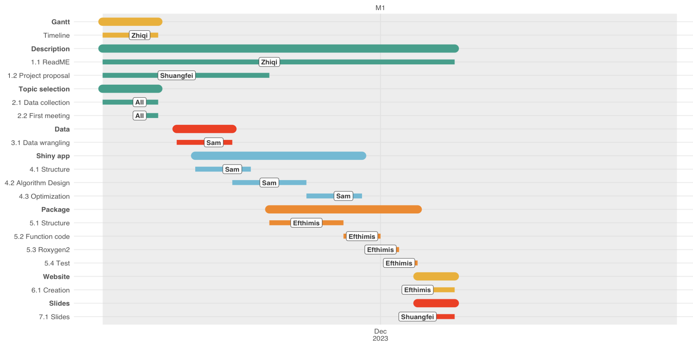
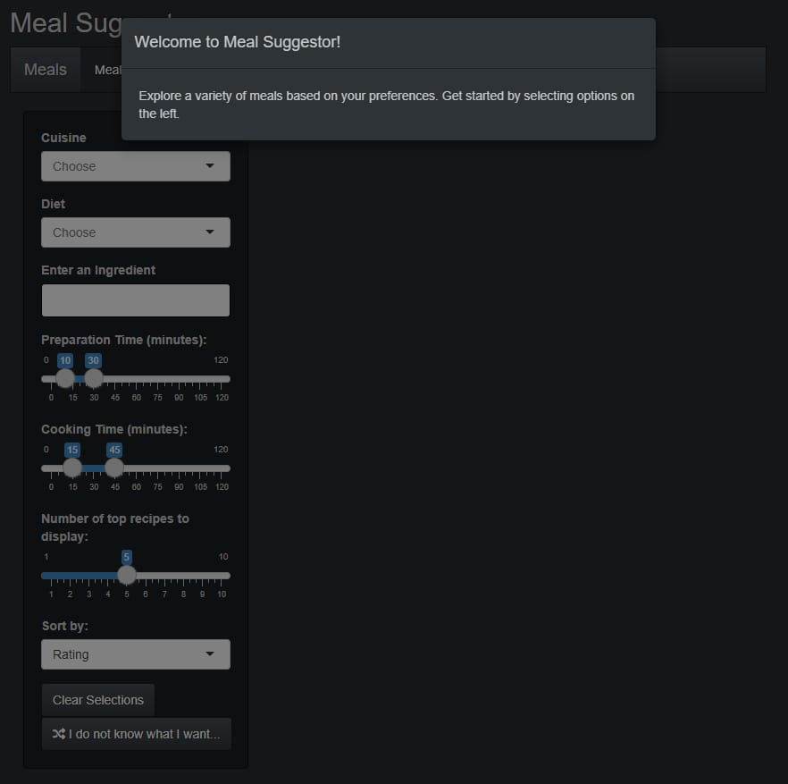
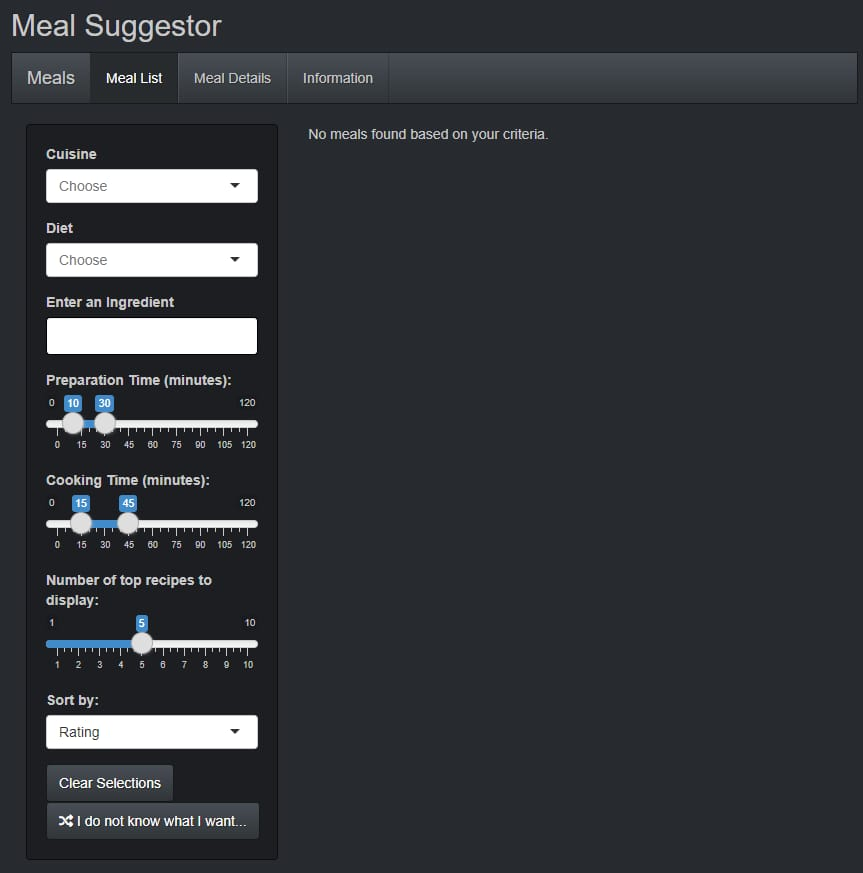
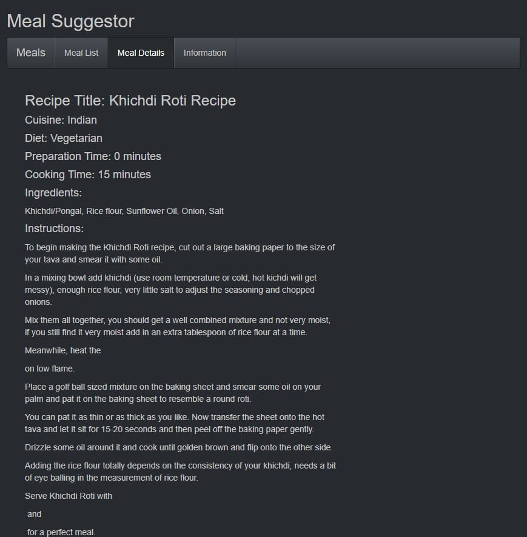

background-image: url("images/food.jpeg")
background-position: center
background-size: contain

#Meal Suggestion Project

```{r setup, include=FALSE}
options(htmltools.dir.version = FALSE)
```
---
class: inverse, center, middle

# Overview
## 1. Objective 
## 2. Methodology 
## 3. Timeline and milestones
## 4. Data Processing
## 5. Website
## 6. ShinyApp & R package
---

# 1. Objective


.middle[## Make meal planning easier and more enjoyable 

Utilizing a comprehensive dataset of diverse recipes, our package offers tailored meal suggestions based on user preferences such as cuisine type, dietary restrictions, and preparation time. Whether you are a cooking enthusiast or just looking for daily meal inspiration, our package is here to help you explore a world of culinary possibilities.]

<style>
.middle {
  margin-top: 150px; 
}
</style>
---

# 2. Methodology

## R packages

.pull-left[
### dplyr
### shiny
### tibble
### devtools
]


.pull-right[
### testthat
### shinythemes
### htmltools
]


---

# 3. Timeline and milestones

.center[]

---

# 4. Data Processing

## Data Source: Kaggle
## Dataset number: 8000+
## Variables
food recipes, approximate cooking and preparation times, cooking instructions,ingredients used, Recipe Author and Ratings
## Processing
- unnecessary columns were removed
- certain columns underwent format conversion

---


# 5. Website


<video width="640" height="360" controls>
  <source src="video/replace.mp4" type="video/mp4">
  Your browser does not support the video tag.
</video>

---

# 6. ShinyApp & R package

## Features
### Cuisine Filter
Find meals from specific cuisines like Mexican, Italian, Indian, and more.
### Dietary Considerations
Filter recipes based on dietary needs such as vegetarian, vegan, or gluten-free options.
### Preparation and Cooking Time
Choose recipes based on the time you have available, from quick snacks to elaborate dinners.
### Ingredient-based Suggestions
Get recommendations based on ingredients you already have at home.

---
# 6.1 R package

Package Source

url:https://github.com/ptds2023/Mealsuggestor/tree/main

---

# 6.2 ShinyApp


.pull-left[## Meal suggestor]

.pull-right[]

---


# 6.2 ShinyApp

.pull-left[

]

.pull-right[

]

---

# 7. Limitation & Future Enhancement

---

class: inverse, center, middle

<html>
  <style>
    .custom-font {
      font-weight: bold;
      font-size: 4em;
    }
  </style>
  <div class="custom-font">Thank you!</div>
</html>

